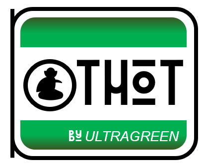
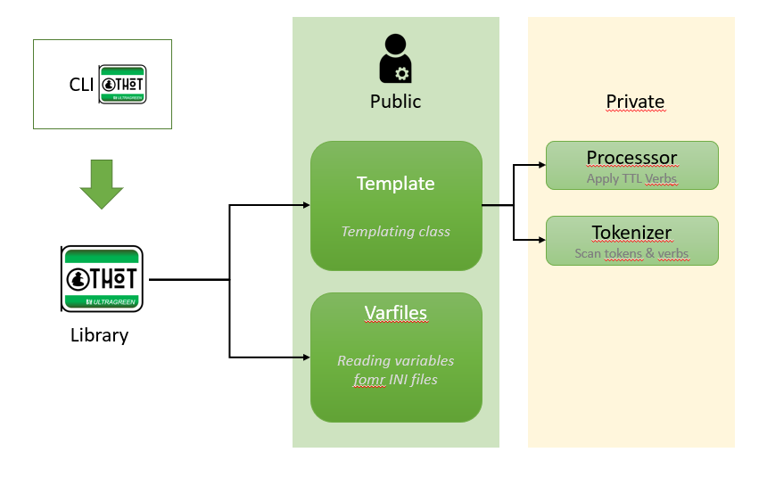
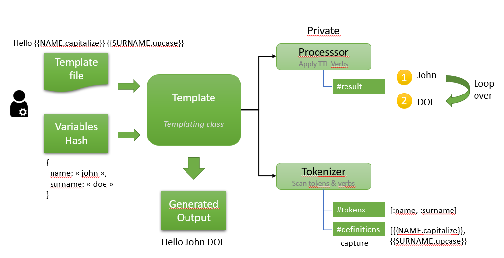
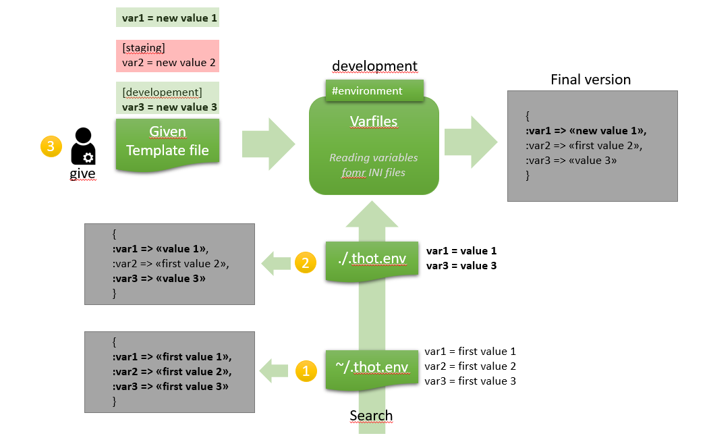

# Thot

Thot is THe Operative Templating : the simpliest solution for Ruby and command to templatize


[](https://rubydoc.info/gems/thot)


[](https://badge.fury.io/rb/thot)


<noscript><a href="https://liberapay.com/ruydiaz/donate"></a></noscript>


 
_The Operative Templating_

## Installation

Add this line to your application's Gemfile:

```ruby
gem 'thot'
```

And then execute:

    $ bundle install

Or install it yourself as:

    $ gem install thot


## Principe

Thot is a simple templating tool, with :
- a template including token, like : **%%TOKEN_NAME%%** => Token MUST be in uppercase
- a hash of data (symbols as keys) corresponding, like : <pre>{token_name: 'value'}</pre>  
It could generate an output.

From versions upper than 1.2.0, Thot support token syntax like **{{TOKEN_NAME}}**

### Global synoptic

 

### Simple usecase

- with data :  <pre>{name: 'Romain'}</pre>
- and template content : "Hello **%%NAME%%** !"

Thot simply generate :
   'Hello Romain !'

### Advanced usecase 

- with data :  <pre>{firstname: 'romain', name: 'georges', nickname: 'zaidyur'}</pre>
- and template content : "Hello **%%FIRSTNAME.capitalize%%** **%%NAME.upcase%%**  your nickname is : **%%NICKNAME.reverse.capitalize%%** !"

Thot generate :
   "Hello Romain GEORGES your nickname is : Ruydiaz !"

This usecase use filters, see it in the following chapter. 
**Note** : Your could monkey patch String or use Refinment for implementing our own filters.  


### Thot templating Language (TTL) reference

- Token cloud be construct with {{TOKEN}} or %%TOKEN%%.
- Token must include filtering methods : Thot actually supports String to String piped filters
  - Filters don't support parameters
  - Filters must be stacked seperated by '.'
  - Filters must be in lowercase
  - Filters must be String instance methods returning a String (Modifier)
- Token should have default value
- Default values don't support multiline correctly.

This is some examples of correct TTL syntaxes : 

With %%TOKEN%% : 
- filters alone : %%NAME.capitalize%% 
- stacked filters alone : %%SURNAME.upcase.reverse%%
- token only with default value : %%TOTO(default value)%%
- token only : %%NAME%% 
- with filters with default value : %%TOTO.downcase(default value static)%%
- stacked filters with default value : %%SURNAME.upcase.reverse(default)%%


with {{TOKEN}} :
- filters alone: {{NAME.capitalize}} 
- stacked filters alone : {{SURNAME.upcase.reverse}}
- token only with default value : {{TOTO(default value)}}
- token only : {{NAME}}
- with filters with default value : {{TOTO.downcase(default value static)}}
- stacked filters with default value : {{SURNAME.upcase.reverse(default)}}


## Usage

Thot is a library for you usage AND a CLI tool. 

###  Ruby Library usage


#### Thot::Template


##### Synoptic

 

you could use Thot in your Ruby code :

##### Examples 

###### Strict mode and accessor input

Note : Considering 'template.txt' with : 'Hello **%%NAME%%** !!'
Note : in strict mode if the Tokens in template file don't match exactly the given token list, Thot raise an exception.  

```ruby
   require 'thot'
   include Thot
   template = Template::new list_token: [:name] , template_file: './template.txt'
   template.name = 'Romain'
   puts template.output
```

return

   Hello Romain !!


###### Strict mode false with accesor input and template_content

```ruby
   require 'thot'
   include Thot
   template = Template::new list_token: [:name, :surname] , template_content: 'Hello %%NAM%% !!'
   template.name = 'Romain'
   puts template.output
```

return

    Hello Romain !!

###### Strict mode false with map input and template_content

```ruby
   require 'thot'
   include Thot
   template = Template::new list_token: [:name, :surname] , template_content: 'Hello %%NAME%% !!'
   template.map {name: 'Romain', surname: 'Georges' }
   puts template.output
```

return

   Hello Romain !!

#### Thot::Varfiles


##### Synoptic

 

##### Example 

###### File format

**Note** : format support is the same for .thot.env files AND given files.

Varfiles support both INI and flat format, like :

for flat : 

```
    key=value
    key = value
      key = value
    # comments and other lines are ignored
```

for INI :

```
    key=value
    key = value
      key = value
    # comments and other lines are ignored

    [EVT]
    key=value
    key = value
      key = value
    # comments and other lines are ignored
```

**Note** : section are overrides of global values

###### Sample files for examples

./.thot.env file :

```
    key=first value
    key2=first value 
```


Given file : "/path/to/myfile.ini"

```
    key=value
   
    [development]
    key=dev value

    [staging]
    key=staging value
    
```
###### For :developement evt, without changing dotfiles preloaded.


```ruby
   require 'thot'
   include Thot
   vars = Varfiles::new varfile: "/path/to/myfile.ini"
   pp vars.data  
```

output 

   {key: "dev value", key2: "first value"}

###### For :staging evt, without changing dotfiles preloaded.


```ruby
   require 'thot'
   include Thot
   vars = Varfiles::new varfile: "/path/to/myfile.ini", environment: :staging
   pp vars.data  
```

output 

   {key: "staging value", key2: "first value"}


###### For :staging evt, changing dotfiles.

**Note** : default dotfiles priority is : ["~/.thot.env","./.thot.env"]


```ruby
   require 'thot'
   include Thot
   vars = Varfiles::new varfile: "/path/to/myfile.ini", environment: :staging, dotfiles: []
   pp vars.data  
```

output 

   {key: "staging value"}

###   CLI usage

Thot come with a CLI for templating, you could :
- reading from STDIN or list files arguments
- getting values from variables file by argument   --env-var-file, -f FILENAME or from Thot Varfile, see after
- display output on STDOUT
- verbose mode on STDERR if -v options.
- defining environment with --environment, -e ENV (efault environement is :development)
- debug mode on STDERR if -d options (cumulative with verbose).

Note : the Thot CLI look for ~/.thot.env file or ./.thot.env file

This file support INI format or flat format, keys in INI format are used for environment override


Note : CLI work only strict mode false, you could have unused keys in datas and undefined value for tokens (substitute by ''). 

Order for variable priorities :
- ~/.thot.env
- ./.thot.env
- file passed by --env-var-file


#### Pre-requisites

* a file 'template.ttl' with : "Hello **%%NAME%%** !!"
* a variables file with lines, like :
```
    key=value
    key = value
      key = value
    # comments and other lines are ignored
```

sample, env.test: 

```
    name=Romain
```

In the same path

#### STDIN from echo

```
    $ echo "Hello %%NAME%% !!" |thot -f env.test
```

#### STDIN from input

```
    $ thot -f env.test < template.ttl
```

#### Typical usage

```
    $ thot -f env.test < template.ttl > output.txt
```

###


## Development

After checking out the repo, run `bin/setup` to install dependencies. Then, run `rake spec` to run the tests. You can also run `bin/console` for an interactive prompt that will allow you to experiment.

To install this gem onto your local machine, run `bundle exec rake install`. To release a new version, update the version number in `version.rb`, and then run `bundle exec rake release`, which will create a git tag for the version, push git commits and tags, and push the `.gem` file to [rubygems.org](https://rubygems.org).

## Contributing

Bug reports and pull requests are welcome on GitHub at https://github.com/Ultragreen/thot.


## License

The gem is available as open source under the terms of the [MIT License](https://opensource.org/licenses/MIT).
